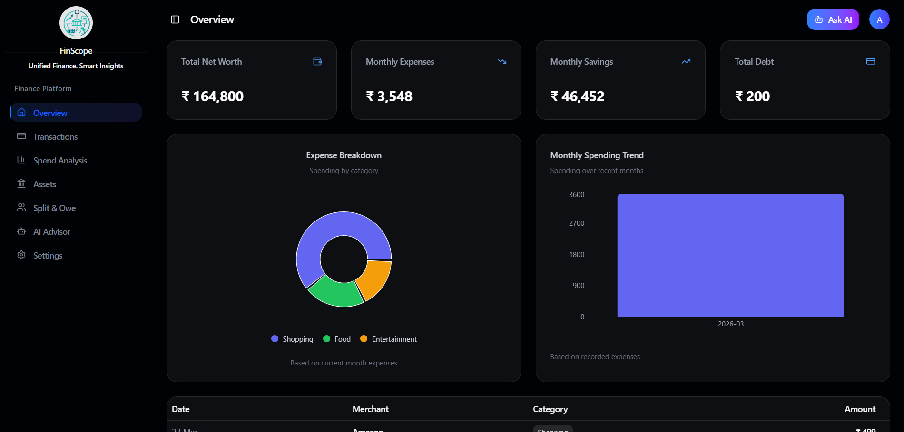
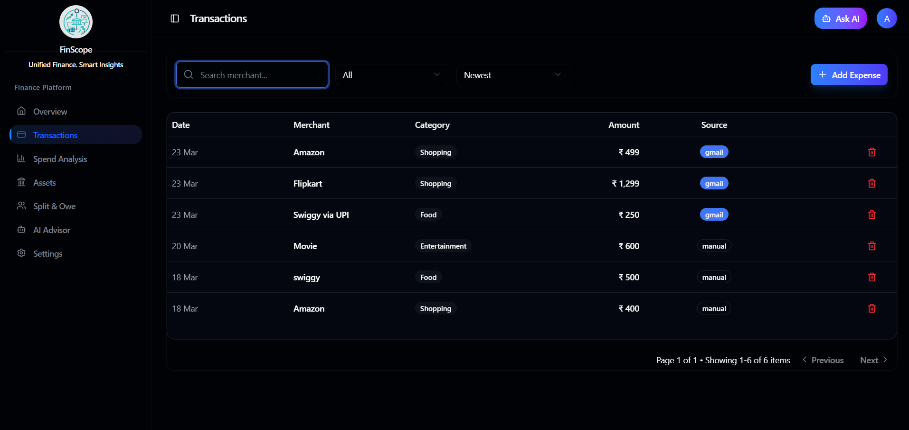
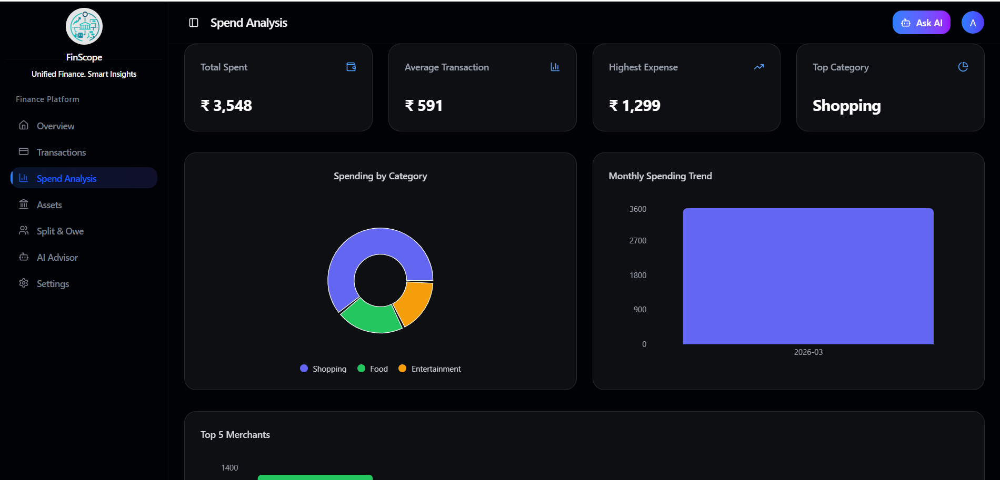
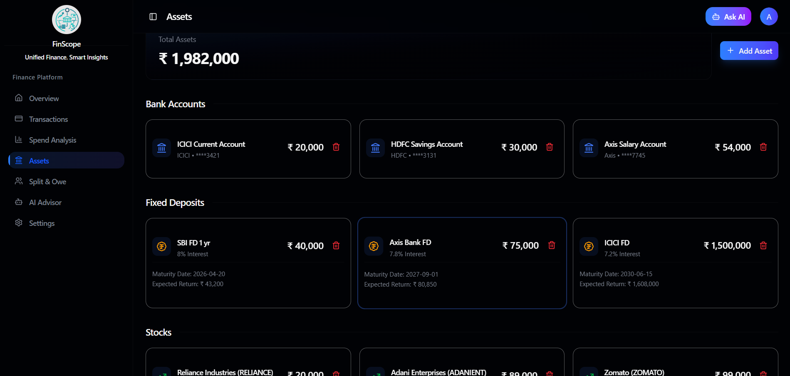
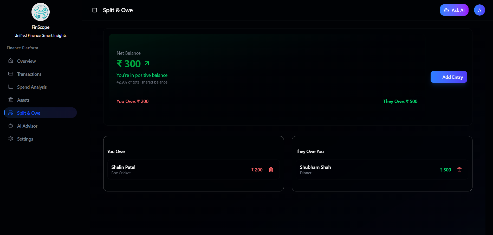
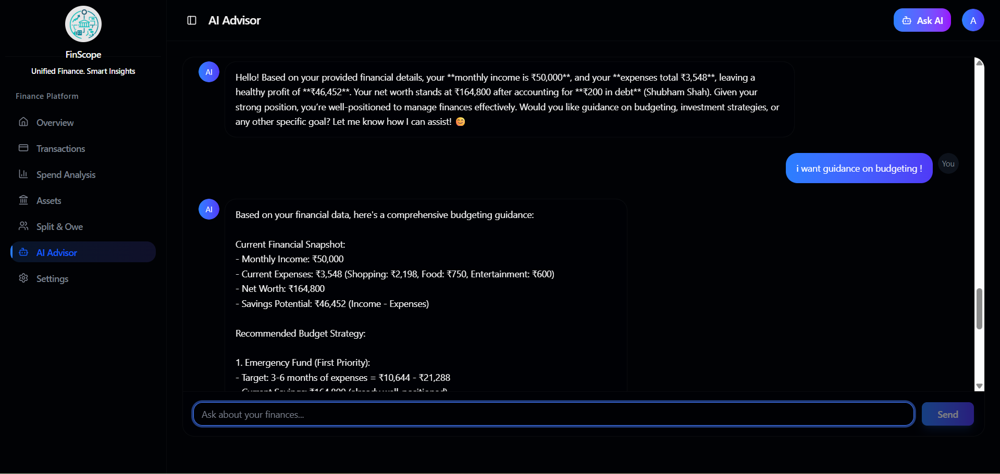
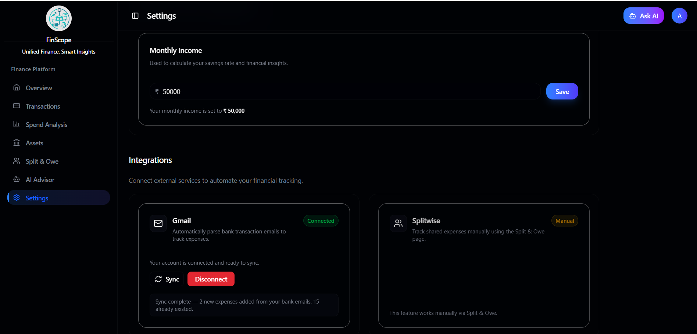

<div align="center">

# 💰 AI Finance Dashboard

**A full-stack AI-powered fintech dashboard that aggregates financial data, automates expense tracking, and provides intelligent insights — built with modern SaaS architecture.**

</div>

---

## 🌐 Live Demo

👉 **[https://ai-finance-dashboard-xi.vercel.app/](https://ai-finance-dashboard-xi.vercel.app/)**

---

## 🚀 Overview

Managing personal finances across multiple platforms is fragmented — bank apps, UPI, emails, investments, and shared expenses all live in different places.

This project solves that by building a **unified finance dashboard** that:

- 📦 Aggregates financial data in one place
- 📩 Automates expense tracking via Gmail parsing
- 🤖 Provides AI-powered financial insights
- 📊 Visualizes financial health with a clean SaaS UI

---

## 📸 Screenshots

| Dashboard                                | Transactions                                  |
| ---------------------------------------- | --------------------------------------------- |
|  |  |

| Analytics                               | Assets                             |
| --------------------------------------- | ---------------------------------- |
|  |  |

| Split & Owe                                | AI Chat                             |
| ------------------------------------------ | ----------------------------------- |
|  |  |

<div align="center">

| Settings                               |
| -------------------------------------- |
|  |

</div>

---

## ✨ Features

<details>
<summary><b>📊 Dashboard Overview</b></summary>
<br>

- Net Worth summary
- Monthly expenses & savings
- Debt overview
- Expense category pie chart
- Monthly trend chart
- Recent transactions

</details>

<details>
<summary><b>💳 Transactions Management</b></summary>
<br>

- Add / Delete expenses
- Search by merchant
- Filter by category
- Sort by date / amount
- Pagination support

</details>

<details>
<summary><b>📈 Spend Analysis</b></summary>
<br>

- Category-wise breakdown
- Monthly spending trends
- Insight-driven charts

</details>

<details>
<summary><b>💼 Assets Management</b></summary>
<br>

Supports:

- Bank Accounts
- Fixed Deposits
- Stocks
- Mutual Funds

Includes:

- Profit/Loss tracking
- Maturity details
- Investment insights

</details>

<details>
<summary><b>🤝 Split & Owe</b></summary>
<br>

- Track who you owe
- Track who owes you
- Net balance calculation

</details>

<details>
<summary><b>🤖 AI Financial Advisor</b></summary>
<br>

- Chat-based interface
- AI powered via OpenRouter
- Financial insights based on user data

</details>

<details>
<summary><b>📩 Gmail Expense Automation 🔥</b></summary>
<br>

- Google OAuth integration
- Fetch Gmail transaction emails
- Parse expenses using regex
- Automatically store expenses

```
Email → Parsed → Saved → Dashboard Updated
```

</details>

<details>
<summary><b>⚙️ Settings</b></summary>
<br>

- Monthly income configuration
- Gmail integration & sync

</details>

---

## 🛠 Tech Stack

### Frontend

| Technology               | Purpose              |
| ------------------------ | -------------------- |
| React + TypeScript       | UI framework         |
| Tailwind CSS + shadcn/ui | Styling & components |
| Recharts                 | Data visualization   |
| React Router             | Client-side routing  |
| Lucide Icons             | Icon library         |

### Backend

| Technology           | Purpose             |
| -------------------- | ------------------- |
| Node.js + Express.js | Server & REST API   |
| MongoDB (Mongoose)   | Database            |
| JWT                  | Authentication      |
| Google APIs (Gmail)  | Email parsing       |
| OpenRouter AI API    | AI-powered insights |

---

## 🏗 System Architecture

```
React Frontend
      ↓
Service Layer (API abstraction)
      ↓
Axios (JWT Authentication)
      ↓
Node.js + Express Backend
      ↓
Controllers + Middleware
      ↓
MongoDB Database
      ↓
External APIs
   ├── Gmail API (Expense Parsing)
   └── OpenRouter AI API
```

---

## 🔄 Data Flow

```
User Action
      ↓
React Component
      ↓
Service Layer
      ↓
API Request (JWT attached)
      ↓
Express Backend
      ↓
MongoDB
      ↓
Response → UI Update
```

---

## 🧠 Key Engineering Concepts

### Frontend

- Component-driven architecture
- State-driven UI
- Data pipelines (filter → search → sort)
- Protected routing
- Service-based API layer

### Backend

- REST API design
- JWT authentication
- Middleware architecture
- MongoDB schema design
- Controller-based structure

### Full Stack

- End-to-end data flow
- API integration
- Auth token handling
- Real-time UI updates

---

## ⚙️ Run Locally

### 1. Clone the repo

```bash
git clone https://github.com/your-username/ai-finance-dashboard.git
cd ai-finance-dashboard
```

### 2. Start the Frontend

```bash
cd frontend
npm install
npm run dev
```

### 3. Start the Backend

```bash
cd backend
npm install
npm run dev
```

### 4. Environment Variables

Create a `.env` file in `/backend`:

```env
MONGO_URI=your_mongo_uri
JWT_SECRET=your_secret
GOOGLE_CLIENT_ID=xxx
GOOGLE_CLIENT_SECRET=xxx
GOOGLE_REDIRECT_URI=http://localhost:5000/api/gmail/callback
```

---

## 📈 What Makes This Project Stand Out

| Feature             | Details                                       |
| ------------------- | --------------------------------------------- |
| 🏗 Full-Stack       | React + Node.js + MongoDB end-to-end          |
| 🤖 AI-Powered       | OpenRouter-based financial advisor            |
| 📩 Gmail Automation | Rare feature — auto-parses transaction emails |
| 🎨 SaaS UI          | Clean, production-grade design                |
| 🔐 Auth             | JWT-secured protected routes                  |

---

## 🔮 Future Improvements

- [ ] 📱 SMS / UPI expense tracking
- [ ] 🧠 AI-based expense categorization
- [ ] 🔄 Background sync via cron jobs
- [ ] 📊 Advanced analytics
- [ ] 🎯 Financial goal tracking

---

## ⚠️ Note

> UI improvements are still in progress. Some UX refinements and polishing are ongoing.

---

## 🎯 Project Goal

To demonstrate how to build a **modern AI-powered fintech dashboard** with clean architecture, real integrations, scalable design, and strong product thinking.

```
UI → Backend → APIs → AI → Automation
```

---

<div align="center">

⭐ **If you found this interesting, feel free to explore, fork, or give feedback!**

</div>
